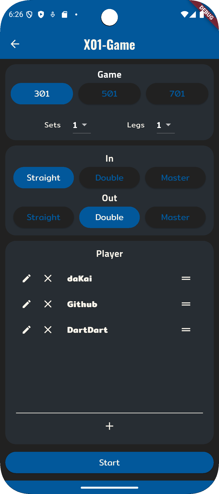
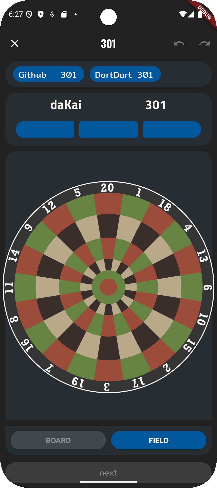
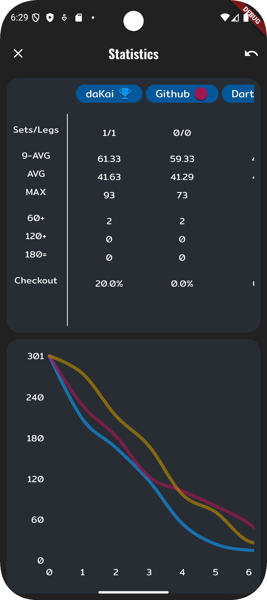

[](https://codecov.io/gh/da-Kai/DartDart)

# </img> DartDart

DartDart, The Dart-Scoreboard App, is built using flutter and dart and is intended to be simple, modern and ad-free. It allows you to keep track of your dart games.

<p align="center">
  
  
  
</p>

### X01

Play a classic game of 301, 501 or 701.

The App helps with tracking the Scores and gives suggestions for Checkouts.

### *Cricked (Planned)*
### *Round the Clock (Planned)*

## Build

1. Get Dependencies
    ```shell
    flutter pub get
    ```

2. Update Icons
    ```
    dart run flutter_launcher_icons
    ```

### Android
```bash
flutter build apk 
```

### Web
```bash
flutter build web --base-href '/'
```

## Testing

### Web
```bash
flutter run -d "$BROWER" --web-renderer html
```